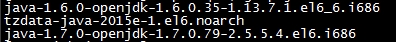
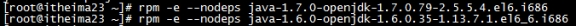
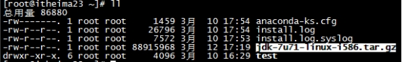
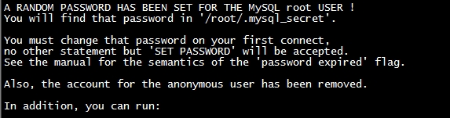

##  *Linux系统上安装JDK：*

### **1.1**  *安装步骤：*

#### **1.1.1** *卸载OpenJDK*

执行命令查看:

- rpm –qa | grep java  查看和java相关的包

 

- 卸载OPENJDK

 

#### **1.1.2** *创建JDK的安装路径：*

在/usr/local/  创建文件夹java

mkdir java

**1.1.3**  *传安装文件到linux:*

 

- cd ~

- ll

 

#### **1.1.4**  *解压tar.gz*

首先需要安装依赖：

l yum install glibc.i686

l tar –xvf xxx.tar.gz –C /usr/local/java

#### **1.1.5** *配置环境变量：*

vim /etc/profile

​	#set java environment

​	JAVA_HOME=/usr/local/src/java/jdk1.7.0_71

​	CLASSPATH=.:$JAVA_HOME/lib.tools.jar

​	PATH=$JAVA_HOME/bin:$PATH

​	export JAVA_HOME CLASSPATH PATH

重新加载配置文件：

source /etc/profile

## *Linux系统上安装MySQL:*

### **1.2** *安装MySQL:*

#### **1.2.1** *上传mysql到Linux:*

 

#### **1.2.1.2** *卸载自带mysql:*

 

#### **1.2.3** *创建mysql的安装路径：*

Mkdir mysql

#### **1.2.4** *解压mysql：*

tar -xvf MySQL-5.6.22-1.el6.i686.rpm-bundle.tar -C /usr/local/mysql

#### **1.2.5** *安装依赖：*

yum -y install libaio.so.1 libgcc_s.so.1 libstdc++.so.6

yum  update libstdc++-4.4.7-4.el6.x86_64

#### **1..6** *安装mysql的服务端：*

rpm -ivh MySQL-server-5.6.22-1.el6.i686.rpm

#### **1.2.7** *安装mysql的客户端：*

rpm -ivh MySQL-client-5.6.22-1.el6.i686.rpm

#### **1.2.8** *启动mysql的服务：*

service mysql status

service mysql start

#### **1.2.9** *登录mysql:*

 

产生一个随机的密码存放在/root/.mysql_secret

查看密码进行登录:

msyql –u root -p

修改密码：

set password = password('123456');

#### **1.2.10** *设置开机自动启动mysql:*

加入到系统服务：

chkconfig --add mysql

自动启动：

chkconfig mysql on

#### **1.2.11** *开启远程服务：*

登录mysql授权可以远程访问:

grant all privileges on *.* to 'root' @'%' identified by '123456';

flush privileges;

#### **1.2.12** *设置Linux的防火墙:*

3306端口放行 且将该设置添加到防火墙的规则中

/sbin/iptables -I INPUT -p tcp --dport 3306 -j ACCEPT

/etc/rc.d/init.d/iptables save

## *Linux系统上安装tomcat：*

### **1.3** *安装tomcat:*

#### **1.3.1** *上传tomcat的安装文件：*

 

#### **1.3.2** *创建tomcat的安装路径：*

在/usr/local 下mkdir tomcat

#### **1.3.3** *解压tomcat*

tar –xvf xxx.tar.gz –C /usr/local/tomcat

#### **1.3.4** *设置防火墙：*

/sbin/iptables -I INPUT -p tcp --dport 8080 -j ACCEPT

/etc/rc.d/init.d/iptables save

#### **1.3.5** *启动tomcat：*

进入到tomcat/bin

执行 ./startup.sh

关闭tomcat

执行 ./shutdown.sh

## *发布项目到Linux：*

### **1.4-1** *将数据库还原到Linux上：*

#### **1.4.1** *备份Window上的数据库：*

使用命令备份：

mysqldump –u root -p store_v2.0 > c:/store_v2.0.sql

 

使用可视化工具：

**1.4.2** *在Linux上还原数据库：*

**1.4-2** *将程序的代码发布到Linux上：**

**1.4.3** *将工程制作为war包：*

 **1.4.4** *将war包上传到linux服务器：*

 **1.4.5** *将war包copy到linux下的tomcat的webapps中：*

**1.4.6** *修改配置文件就可以：*

 

## **1.5** *Nginx*

**1.5.1** *Nginx的概述：*

 

### **1.5.2** *什么是代理和反向代理：*

### **1.5.3** *Nginx+Tomcat的集群配置:*

#### **1.5.3.1** *在一台电脑上安装两个tomcat*

需要在一台电脑模拟：在E盘解压两个tomcat,分别命名为tomcat1，tomcat2.

#### **1.5.3.2** *修改tomcat的配置文件，将端口进行修改:*

修改tomcat2中的端口:

 

 

 

#### **1.5.3.3** *将项目分别发布到两个**tomcat中：*

#### **1.5.3.4** *安装Nginx：*

解压

双击nginx.exe

启动完以后访问http://localhost

