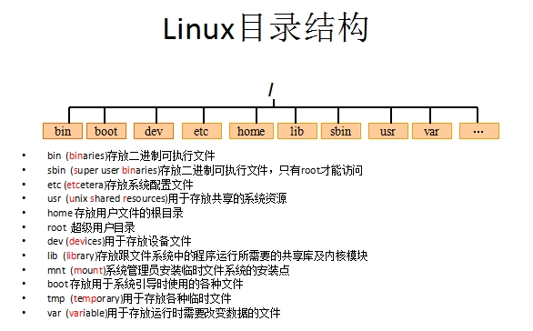
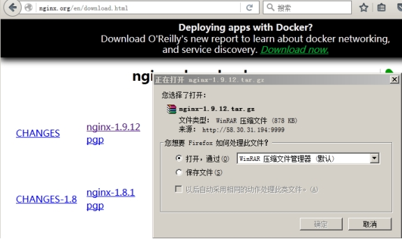
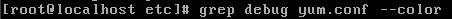
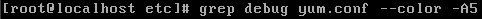
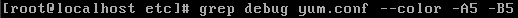
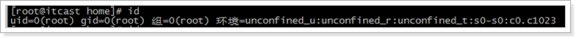
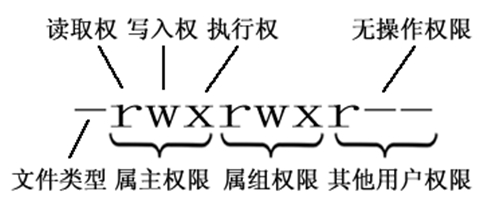

## **1.1** *Linux的安装：*

**1.1.1** *虚拟机安装：*

**1.1.1.1** *什么是虚拟机*

虚拟机：一台虚拟的电脑.

虚拟机软件:

VmWare		:收费的.

VirtualBox	:免费的.

#### **1.1.1.2** *安装VmWare*

参考《虚拟软件vmware安装.doc》

### **1.1.2**  *CentOS的安装*

参考《CentOS6详细安装文档.doc》

### **1.1.3** *Linux的目录结构：*

 

 

root管理员的home目录root

其他用户的home目录home目录中

## **1.2** *Linux的常用命令*

### **1.2.1** *切换目录命令cd：*

使用cd app	切换到app目录cd ..	切换到上一层目录cd /		切换到系统根目录cd ~		切换到用户主目录cd -		切换到上一个所在目录

### **1.2.2** *列出文件列表：ls ll dir*

ls(list)是一个非常有用的命令，用来显示当前目录下的内容。配合参数的使用，能以不同的方式显示目录内容。  格式：ls[参数] [路径或文件名

常用：

在linux中以 . 开头的文件都是隐藏的文件

 

ls

ls -a  显示所有文件或目录（包含隐藏的文件）

ls -l  缩写成ll

### **1.2.3** *创建目录和移除目录：mkdir rmdir*

mkdir(make directory)命令可用来创建子目录。mkdir app  è  在当前目录下创建app目录mkdir –p app2/test  è 级联创建aap2以及test目

rmdir(remove directory)命令可用来删除“空”的子目录：rmdir app  è  删除app目录 

### **1.2.4** *浏览文件*

【cat、more、less】

cat用于显示文件的内容。格式：cat[参数]<文件名>

  cat yum.conf 

more一般用于要显示的内容会超过一个画面长度的情况。按空格键显示下一个画面。

回车显示下一行内容。

按 q 键退出查看。

more yum.conf

  空格显示下一页数据  回车显示下一行的数据 

less用法和more类似，不同的是less可以通过PgUp、PgDn键来控制。

  less yum.conf

  PgUp 和 PgDn 进行上下翻页.

【tail】

tail命令是在实际使用过程中使用非常多的一个命令，它的功能是：用于显示文件后几行的内容。

用法:

tail -10 /etc/passwd  è  查看后10行数据

tail -f catalina.log  è 动态查看日志(*****)

ctrl+c 结束查看

### **1.2.5** *文件操作：*

【rm】

rm  删除文件

用法：rm [选项]... 文件...

rm a.txt  è  删除a.txt文件

删除需要用户确认，y/nrm 删除不询问

rm -f a.txt  è  不询问，直接删除rm 删除目录

rm -r a  è  递归删除不询问递归删除（慎用）

rm -rf  a  è  不询问递归删除

rm -rf *  è  删除所有文件

rm -rf /*  è  自杀

【cp、mv】

cp(copy)命令可以将文件从一处复制到另一处。一般在使用cp命令时将一个文件复制成另一个文件或复制到某目录时，需要指定源文件名与目标文件名或目录。

cp a.txt b.txt  è  将a.txt复制为b.txt文件

cp a.txt ../  è  将a.txt文件复制到上一层目录中 

 

mv 移动或者重命名

mv a.txt ../  è  将a.txt文件移动到上一层目录中

mv a.txt b.txt  è  将a.txt文件重命名为b.txt

 

【tar】命令:(***** 打包或解压)

tar命令位于/bin目录下，它能够将用户所指定的文件或目录打包成一个文件，但不做压缩。一般Linux上常用的压缩方式是选用tar将许多文件打包成一个文件，再以gzip压缩命令压缩成xxx.tar.gz(或称为xxx.tgz)的文件。 常用参数：-c：创建一个新tar文件-v：显示运行过程的信息-f：指定文件名-z：调用gzip压缩命令进行压缩-t：查看压缩文件的内容-x：解开tar文件

 

 

 

打包：

tar –cvf xxx.tar ./*

打包并且压缩：

tar –zcvf xxx.tar.gz ./* 

解压 

   tar –xvf xxx.tar

tar -xvf xxx.tar.gz -C /usr/aaa

【grep】命令

查找符合条件的字符串。

用法: grep [选项]... PATTERN [FILE]...示例：

grep lang anaconda-ks.cfg  在文件中查找lang

grep lang anaconda-ks.cfg –color 高亮显示

 

 

 

### **1.2.6** *其他常用命令*

【pwd】

显示当前所在目录

【touch】

创建一个空文件

\* touch a.txt

【ll -h】

友好显示文件大小

【wget】

下载资料

\* wget http://nginx.org/download/nginx-1.9.12.tar.gz

## **1.3** *Vi和Vim编辑器*

### **1.3.1** *Vim编辑器：*

在Linux下一般使用vi编辑器来编辑文件。vi既可以查看文件也可以编辑文件。三种模式：命令行、插入、底行模式。

切换到命令行模式：按Esc键；

切换到插入模式：按 i 、o、a键；

  i 在当前位置生前插入

  I 在当前行首插入

  a 在当前位置后插入

  A 在当前行尾插入

  o 在当前行之后插入一行

  O 在当前行之前插入一行

 

切换到底行模式：按 :（冒号）；更多详细用法，查询文档《Vim命令合集.docx》和《vi使用方法详细介绍.docx》

打开文件：vim file

退出：esc à :q

修改文件：输入i进入插入模式

保存并退出：escà:wq

不保存退出：escà:q!

 

3中进入插入模式：

i:在当前的光标所在处插入

o:在当前光标所在的行的下一行插入

a:在光标所在的下一个字符插入

快捷键：

dd – 快速删除一行

R – 替换

### **1.3.2** *重定向输出>和>>*

\> 重定向输出，覆盖原有内容；>> 重定向输出，又追加功能；示例：

cat /etc/passwd > a.txt  将输出定向到a.txt中

cat /etc/passwd >> a.txt  输出并且追加

ifconfig > ifconfig.txt

### **1.3.3** *管道 |*

管道是Linux命令中重要的一个概念，其作用是将一个命令的输出用作另一个命令的输入。示例

ls --help | more  分页查询帮助信息

ps –ef | grep java  查询名称中包含java的进程

ifconfig | more

cat index.html | more

ps –ef | grep aio

### **1.3.4** *&&命令执行控制：*

命令之间使用 && 连接，实现逻辑与的功能。  

只有在 && 左边的命令返回真（命令返回值 $? == 0），&& 右边的命令才会被执行。 

只要有一个命令返回假（命令返回值 $? == 1），后面的命令就不会被执行。

mkdir test && cd test

### **1.3.5** *网络通讯命令*

ifconfig  显示或设置网络设备。

ifconfig  显示网络设备

ifconfig eth0 up 启用eth0网卡

ifconfig eth0 down  停用eth0网卡ping  探测网络是否通畅。

ping 192.168.0.1netstat 查看网络端口。

netstat -an | grep 3306 查询3306端口占用情况

### **1.3.6** *系统管理命令*

date 显示或设置系统时间

date  显示当前系统时间

date -s “2014-01-01 10:10:10“  设置系统时间df 显示磁盘信息

df –h  友好显示大小free 显示内存状态

free –m 以mb单位显示内存组昂头top 显示，管理执行中的程序

 

clear 清屏幕 

ps 正在运行的某个进程的状态

ps –ef  查看所有进程

ps –ef | grep ssh 查找某一进程kill 杀掉某一进程

kill 2868  杀掉2868编号的进程

kill -9 2868  强制杀死进程

du 显示目录或文件的大小。

du –h 显示当前目录的大小

 who 显示目前登入系统的用户信息。 

hostname 查看当前主机名

修改：vi /etc/sysconfig/network 

uname 显示系统信息。

uname -a 显示本机详细信息。依次为：内核名称(类别)，主机名，内核版本号，内核版本，内核编译日期，硬件名，处理器类型，硬件平台类型，操作系统名称

## **1.4** *Linux的用户和组*

### **1.4.1** *用户的管理*

useradd 添加一个用户

useradd test 添加test用户

useradd test -d /home/t1  指定用户home目录 

passwd  设置、修改密码

passwd test  为test用户设置密码

切换登录：

ssh -l test -p 22 192.168.19.128

 

su – 用户名

 userdel 删除一个用户

userdel test 删除test用户(不会删除home目录)

userdel –r test  删除用户以及home目录

### **1.4.2** *组管理：*

当在创建一个新用户user时，若没有指定他所属于的组，就建立一个和该用户同名的私有组 

创建用户时也可以指定所在组 

groupadd  创建组

groupadd public  创建一个名为public的组

useradd u1 –g public  创建用户指定组groupdel 删除组，如果该组有用户成员，必须先删除用户才能删除组。

groupdel public

### **1.4.3** *id，su命令*

【id命令】

功能：查看一个用户的UID和GID用法：id [选项]... [用户名]

 

直接使用id

直接使用id 用户名

【su命令】

功能：切换用户。用法：su [选项]... [-] [用户 [参数]... ]示例：

su - u1 切换到u1用户，并且将环境也切换到u1用户的环境（推荐使用）

【账户文件】

/etc/passwd  用户文件/etc/shadow  密码文件/etc/group  组信息文件

【用户文件】

root:x:0:0:root:/root:/bin/bash账号名称：		在系统中是唯一的用户密码：		此字段存放加密口令用户标识码(User ID)：  系统内部用它来标示用户组标识码(Group ID)：  系统内部用它来标识用户属性用户相关信息：		例如用户全名等用户目录：		用户登录系统后所进入的目录用户环境:		用户工作的环境

【密码文件】

shadow文件中每条记录用冒号间隔的9个字段组成.用户名：用户登录到系统时使用的名字，而且是惟一的口令：  存放加密的口令最后一次修改时间:  标识从某一时刻起到用户最后一次修改时间最大时间间隔:  口令保持有效的最大天数，即多少天后必须修改口令最小时间间隔：	再次修改口令之间的最小天数警告时间：从系统开始警告到口令正式失效的天数不活动时间：	口令过期少天后，该账号被禁用失效时间：指示口令失效的绝对天数(从1970年1月1日开始计算)标志：未使用 

【组文件】

root:x:0:组名：用户所属组组口令：一般不用GID：组ID用户列表：属于该组的所有用户

## **1.5** *Linux的权限命令*

### **1.5.1** *文件权限*

 

| *属主（user）* | *属组（group）* | *其他用户* |      |      |      |      |      |      |
| -------------- | --------------- | ---------- | ---- | ---- | ---- | ---- | ---- | ---- |
| r              | w               | x          | r    | w    | x    | r    | w    | x    |
| 4              | 2               | 1          | 4    | 2    | 1    | 4    | 2    | 1    |

 

### **1.5.2**  *Linux三种文件类型：*

普通文件： 包括文本文件、数据文件、可执行的二进制程序文件等。 

 目录文件： Linux系统把目录看成是一种特殊的文件，利用它构成文件系统的树型结构。  

设备文件： Linux系统把每一个设备都看成是一个文件

### **1.5.3** *文件类型标识*

普通文件（-）目录（d）符号链接（l）

进入etc可以查看，相当于快捷方式字符设备文件（c）块设备文件（s）套接字（s）命名管道（p）

### **1.5.4** *文件权限管理：*

chmod 变更文件或目录的权限。

chmod 755 a.txt 

chmod u=rwx,g=rx,o=rx a.txt

chmod 000 a.txt  / chmod 777 a.txtchown 变更文件或目录改文件所属用户和组

chown u1:public a.txt	：变更当前的目录或文件的所属用户和组

chown -R u1:public dir	：变更目录中的所有的子目录及文件的所属用户和组
